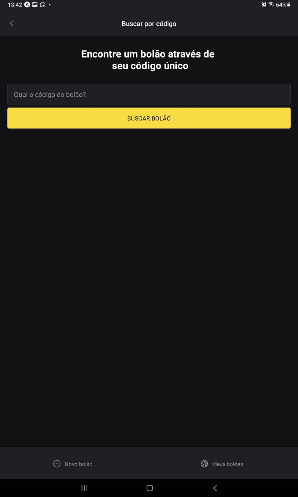
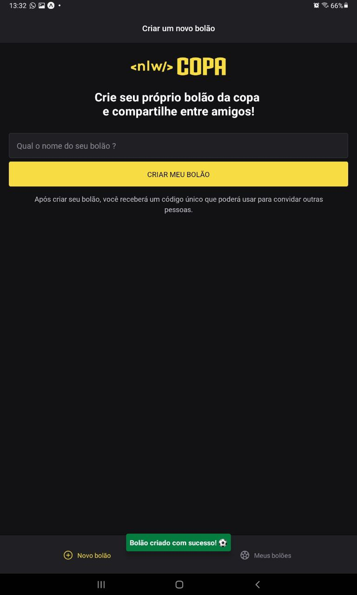
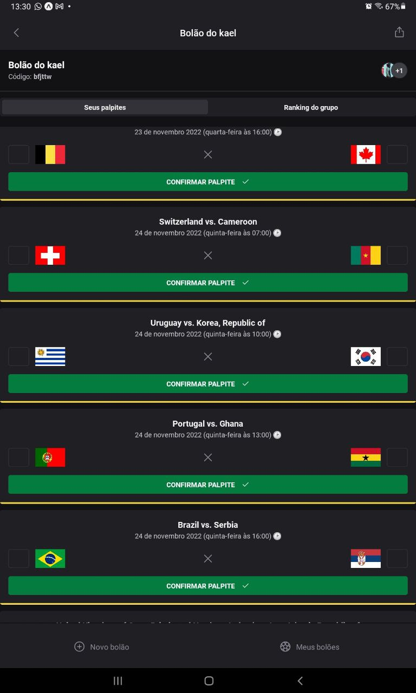
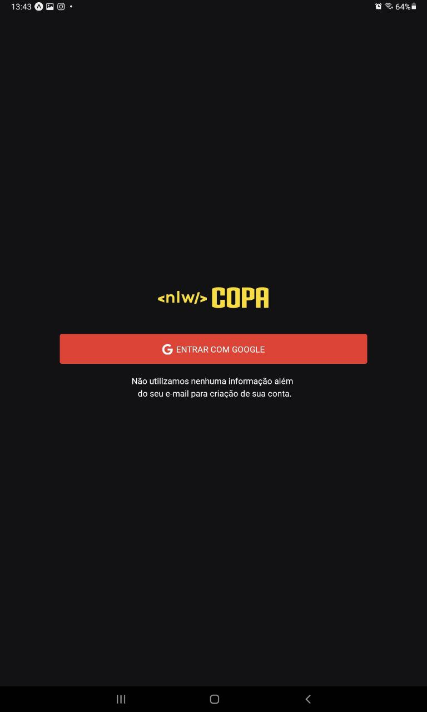
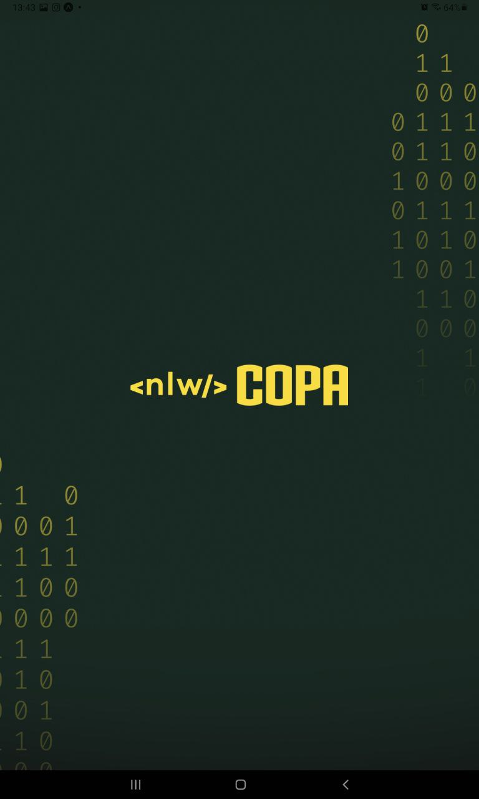
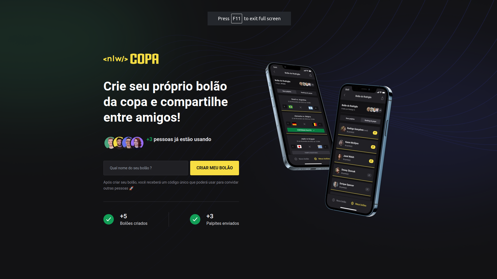

  

[**Sobre**](#projeto) &nbsp;&nbsp;**|**&nbsp;&nbsp;
[**Tecnologias**](#-tecnologia) &nbsp;&nbsp;**|**&nbsp;&nbsp;
[**Instalação e execução**](#-como-executar) &nbsp;&nbsp;**|**&nbsp;&nbsp;
[**Progresso**](#progresso) &nbsp;&nbsp;**|**&nbsp;&nbsp;
[**Telas**](#-resultado-telas) &nbsp;&nbsp;**|**&nbsp;&nbsp;
[**Layout**](#-layout) &nbsp;&nbsp;**|**&nbsp;&nbsp;
[**Licença**](#-license)

## Projeto
Projeto dedicado para copa do mundo de 2022. O projeto é composto de três partes. [back-end](server), [front-end-web](web)
e [front-end-mobile](mobile-copa). Aqui aprendi diversos conceitos interessantes tais como trabalhar um pouco com datas,
autenticação com JWT e OAuth 2.0.

Através do [front-end web](web) é possível criar bolão. Com o [front-end mobile](mobile-copa) é possível consultar os bolões existentes, criar novos bolões,
registrar palpites e listar o rank. [Telas aqui](#-resultado-telas).

## ✨ Tecnologia

- [TypeScript](https://www.typescriptlang.org/)
- [React](https://reactjs.org/)
- [React Native](https://reactnative.dev/)
- [Expo](https://expo.dev/)
- [Fastify](https://www.fastify.io/)
- [Prisma](https://www.prisma.io/)
- [Docker 🐳](https://www.docker.com/)
- [MySQL](https://www.mysql.com/)
- [JWT](https://jwt.io/)

## 🚀 Como executar

Em todos os projetos, ao acessar a pasta, é preciso baixar os pacotes com o gerenciador de sua preferencia.

Acesse a documentação de cada projeto:

- [Backend](./server/README.md)
- [Web](./web/README.md)
- [Mobile](./mobile-copa/README.md)

## Progresso
Duração do curso ≃  12H e 30 MIM 🕗
1. [x] [Aula 01](aula01)
2. [X] [Aula 02](aula02)
3. [X] [Aula 03](aula03)
4. [X] [Aula 04](aula04)
5. [X] [Aula 05](aula05)

## 🖼 Resultado telas
### 📱 Mobile 
<table>
  <tr>
    <td>
      <figure>
        
        <figcaption>Buscar bolão</figcaption>
      </figure>
    </td>
    <td>
      <figure>
        
        <figcaption>Criar bolão</figcaption>
      </figure>
    </td>
    <td>
      <figure>
        
        <figcaption>Tela dos jogos</figcaption>
      </figure>
    </td>
  </tr>
  <tr>
    <td>
      <figure>
        
        <figcaption>Login com Google</figcaption>
      </figure>
    </td>
    <td>
      <figure>
        
        <figcaption>Splash</figcaption>
      </figure>
    </td>
  </tr>
</table>

## 💻 Web
<table>
  <tr>
    <td>
      <figure>
        
        <figcaption>Tela web para cadastro de bolão</figcaption>
      </figure>
    </td>
  </tr>
</table>

  
  

## 🔖 Layout

Você pode visualizar o layout do projeto através do link abaixo:

- [Layout](https://www.figma.com/file/ch3jTNppSKzmNnOQvzaKXj/Bol%C3%A3o-da-Copa-(Community)?node-id=0%3A1&t=0smefDV6IVOqWyFW-1)

Lembrando que você precisa ter uma conta no [Figma](http://figma.com/).

## 📝 License

Esse projeto está sob a licença MIT. Veja o arquivo [LICENSE](LICENSE) para mais detalhes.

---

  Never stop learning 🚀

