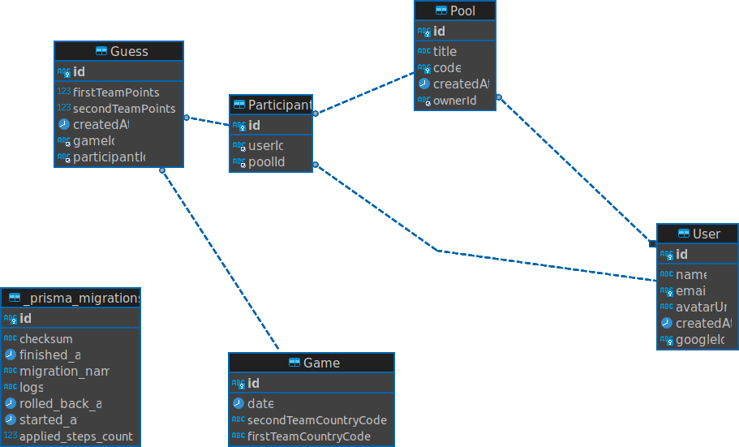

# Back-End

## 🚀 Subindo o docker e o servidor
1. Renome o arquivo [.env.example](./.env.example) para **.env**;
2. É necessário o [docker](https://www.docker.com/) e [docker compose](https://docs.docker.com/compose/install/linux/) instalados.
   1. `docker compose up -d` _(Irá fazer o build e subir o container do MySQL)_
3. Execute `npx prisma migrate dev` para rodar as migrations. _(Esse comando também já vai executar as seeds)_
4. Execute `npm run dev` para iniciar o servidor.

## DER (Diagrama relacional do banco)

